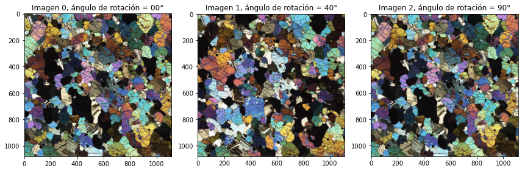
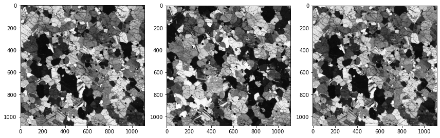
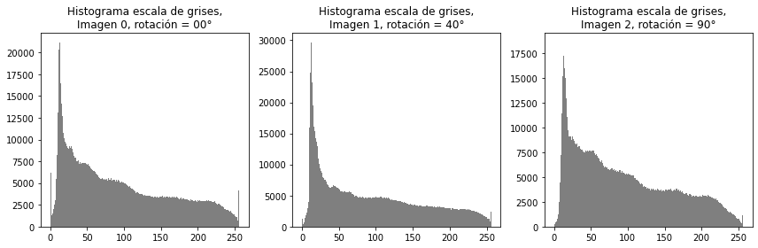
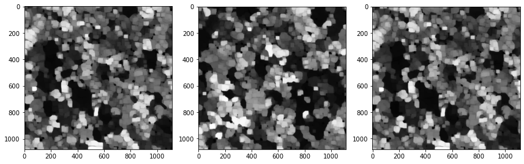
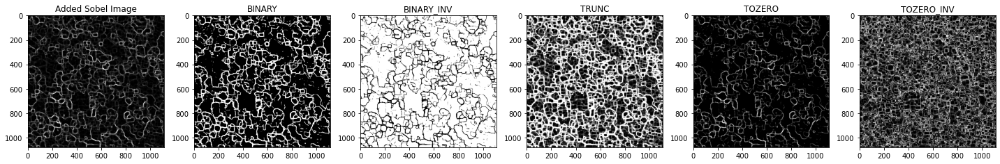
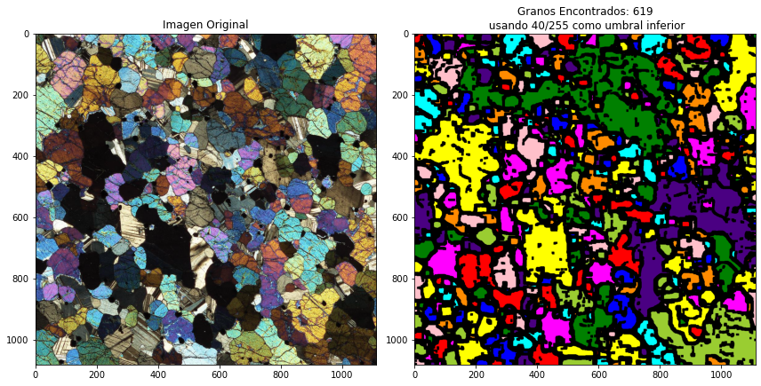

## Grain Counting using preprocessing by Eicken and Watershed algorithm

Implementation of techniques given originally by Eicken, 1993. Using edge detection algorithms to describe textural features in Ice Thin Sections (yes, Ice is anisotropic, hexagonal) and using a watershed algorithm I take a Troctolite (from the Macquaire University Database) for implementing this paper and a final watershed algorithm for grain counting; the results although not perfect are quite reasonable for an old algorithm (in a few days I will try with a more recent one, HED; check my repo: https://github.com/ieferreira/Grain-Counting-HED-Algorithm).

### Original images

Three images of a troctolite, in three rotations (0°, 40°, 90°)

### Grayscale images

Implementation of Eicken is given in grayscale... maybe separating into channels (R,G,B) or using another color space and then adding the results for each color channel.

### Grayscale histograms

An Important part of the implementation is the difference in birefrigency at different angles, as is shown in the middle image (40°, optimally it should be 45°) the histograms  lowers

### Erosion and dilation (morphological opening) and low-pass filter

### Testing different binarization algorithms

### Binarization is left to the user, but a 20-60 lower threshold is advised

Playing with the lower threshold for the final binarization

## Final result

The original image and the watershed one with the number of grains found

### References

- Eicken, H. (1993) Automated image analysis of ice thin sections - instrumentation, methods and extraction of stereological and textural parameters. Journal of Glaciology
- Bhattiprolu, S. Grain Size Analysis in Python Using Watershed. https://github.com/bnsreenu/python_for_microscopists/blob/master/033-grain_size_analysis_using_wateshed_segmentation.py
